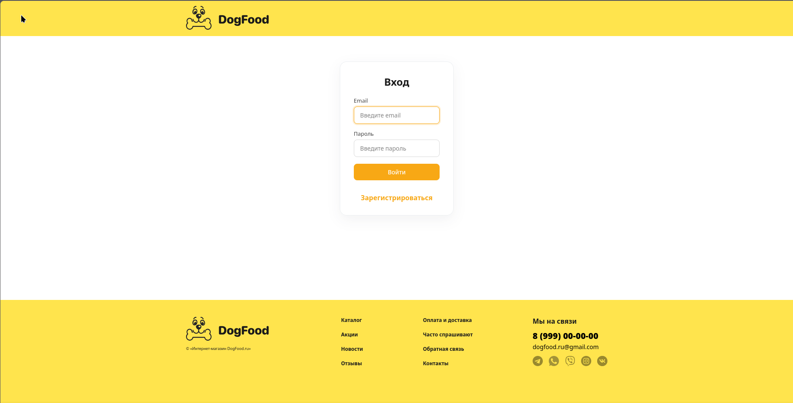
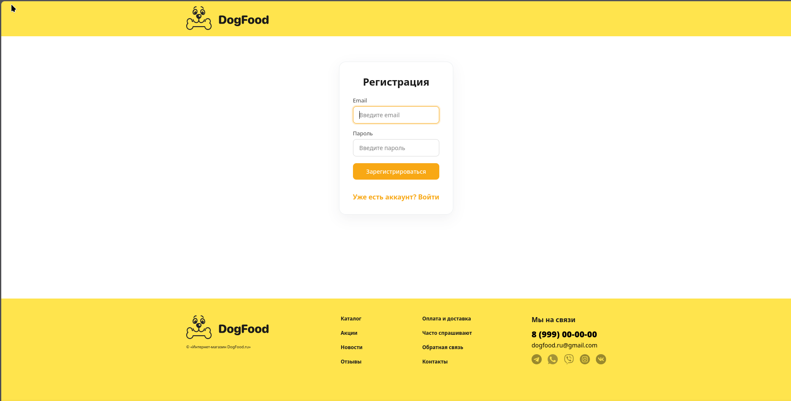
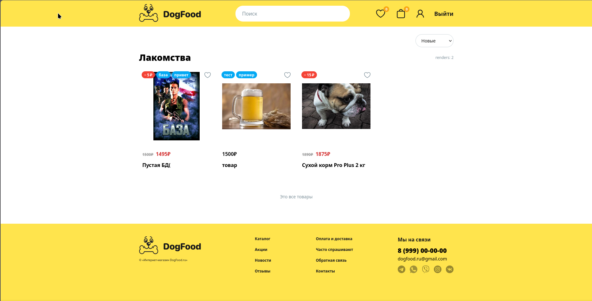
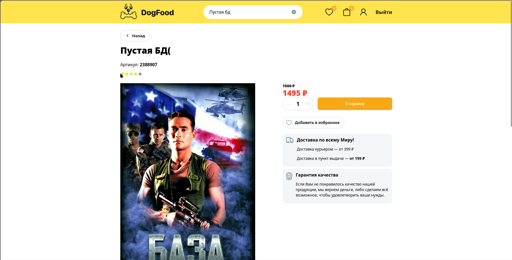
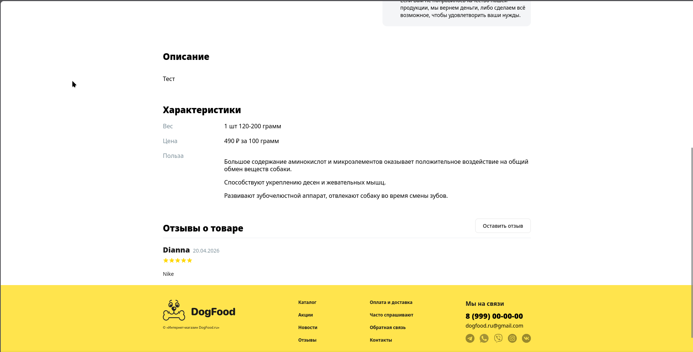
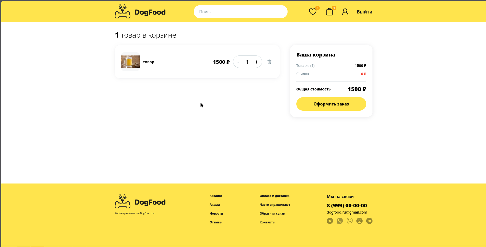
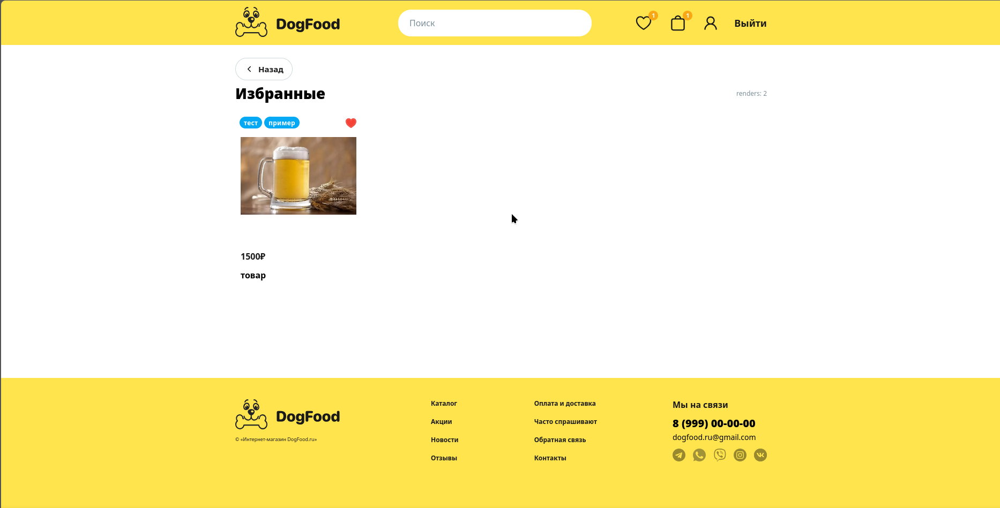
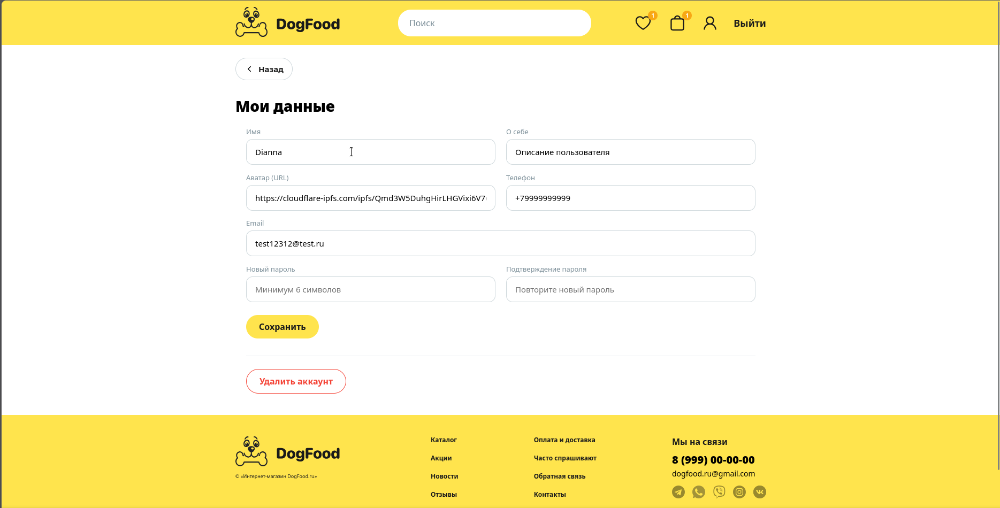
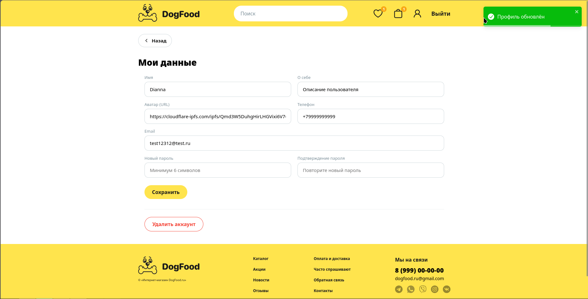

# DogFood

---

## Что сделано

- **FSD (6 слоёв)** - `app`, `pages`, `widgets`, `features`, `entities`,
  `shared` c публичными API через `index.ts` и алиасами
  `@app / @pages / @widgets / @features / @entities / @shared`.
- **React 19** (`react@19`, `react-dom@19`, `@types/react@19`).
- **Два бандлера**: Webpack 5 (оригинальный) + **Vite 6 + SWC** параллельно.
- **React 19 hooks**:
  - `useOptimistic` - мгновенная смена иконки «избранное» до ответа сервера,
    откат при ошибке (`@features/toggle-like`).
  - `useActionState` - форма отзыва: управляет состоянием отправки, ошибками,
    авто-сброс формы на успех (`@features/add-review`).
- **3 кейса `useRef`**:
  1. Автофокус на email-инпуте формы логина (`@features/auth/SignInForm`).
  2. `triggerRef` в модалке - запомнить триггер при открытии, вернуть фокус
     на него при закрытии (`@shared/ui/Modal`).
  3. Счётчик перерендеров в `@widgets/CardList` - `useRef(0)` + инкремент без
     повторного рендера (видно только в dev-сборке).
- **Модалка через `React.createPortal`** (`@shared/ui/Modal`):
  монтируется в `#modal-root`, ESC и клик по оверлею закрывают, фокус при
  открытии уходит на крестик закрытия, при закрытии возвращается на триггер,
  `body` блокируется от скролла.
- **`shared/ui`-примитивы**: `Button`, `Input`, `Loader`, `Modal`.
- **Оптимизации**:
  - `React.memo` у `ProductCard`, `ReviewCard`, `CartItem`, `LikeButton`,
    `CardList`, `CartCounter`, `Rating`.
  - `useMemo` - суммы в `CartAmount`, список опций в `useSort`.
  - `useCallback` - все обработчики в `CartItem`, `CartCounter`, `useCartCount`,
    `useAddToCart`, `LikeButton`, `ReviewList`.
- Чистка завязки на MUI в `WithQuery` (был импорт целого `@mui/material`
  только ради `Alert`).
- Миграция импортов SVG на синтаксис `?react` - работает и в Vite (через
  `vite-plugin-svgr`), и в Webpack (через `@svgr/webpack` в `oneOf` по
  `resourceQuery: /react/`); URL-импорты оставлены для изображений.

## Webpack vs Vite+SWC

Замер: чистая сборка production (без прогретого кеша) на этом проекте,
Node 22, Linux.

| Метрика                  | Webpack 5 + ts-loader | Vite 6 + SWC       | Разница  |
|--------------------------|-----------------------|---------------------|----------|
| Время prod-сборки        | ~7.4 с                | ~2.0 с              | ~3.7×    |
| Размер `dist` / `dist-vite` | 548 KB              | 536 KB              | сопоставимо |
| Основной JS-чанк         | 423 KB (1 файл)       | 464 KB (1 файл)     | сопоставимо |
| Dev-старт                | ~2–3 с до первого байта | мгновенный         | -        |
| HMR                      | через react-refresh    | нативный, быстрее  | -        |
| TS-трансформация         | ts-loader (тайпчек)   | SWC (без тайпчека, `tsc --noEmit` отдельно) | Vite ощутимо быстрее |

Ключевые различия в конфигурации:

- Webpack: ручные правила для `.svg` (два варианта через `oneOf` по
  `resourceQuery: /react/`), `css-loader` с `modules.auto`,
  `MiniCssExtractPlugin` в prod, `webpack.DefinePlugin` под `process.env`.
- Vite: три плагина - `@vitejs/plugin-react-swc`, `vite-plugin-svgr`,
  `vite-tsconfig-paths`. Поддержка CSS-модулей из коробки.

---

## Скриншоты

### Логин

### Регистрация

### Каталог

### Карточка товара

### Отзывы

### Корзина

### Избранные

### Профиль

### Toastify
